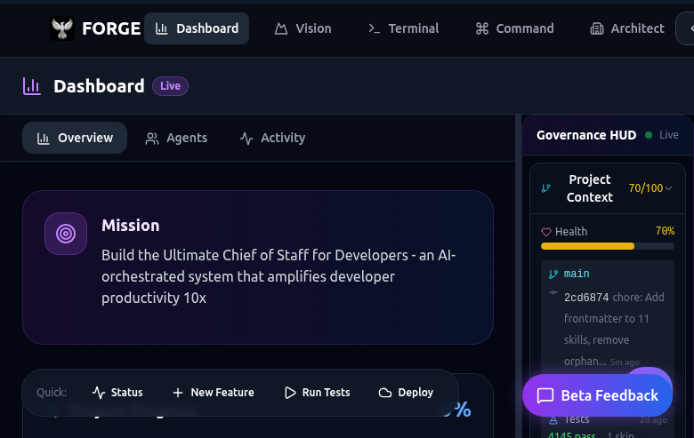
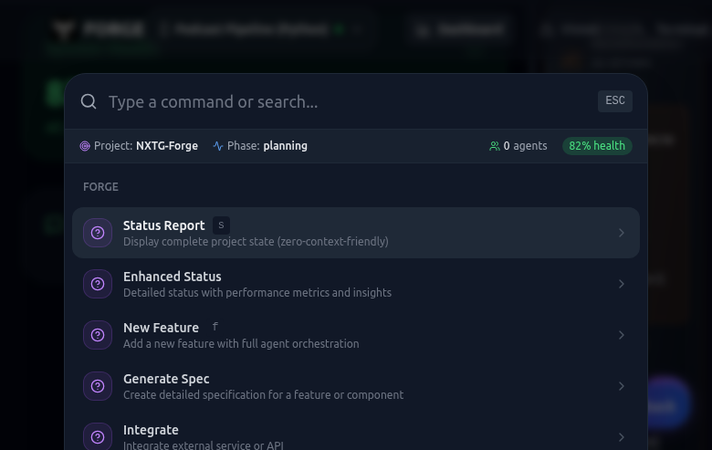
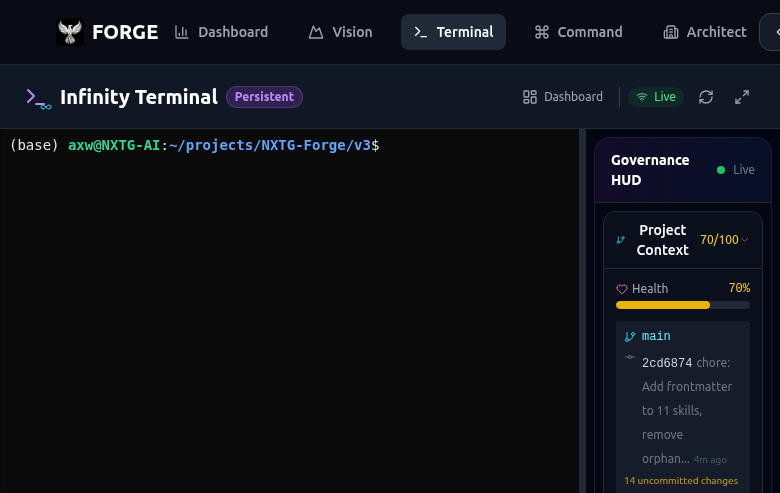

<p align="center">
  
</p>

<p align="center">
  <strong>The AI Development Platform</strong><br>
  <sub>Governance. Agents. Dashboard. Terminal. All in one.</sub>
</p>

<p align="center">
  <a href="#"></a>
  <a href="#"></a>
  <a href="#"></a>
  <a href="LICENSE"></a>
  <a href="#"></a>
</p>

<p align="center">
  21 commands &middot; 22 agents &middot; 58 UI components &middot; Infinity Terminal &middot; MCP dashboard<br>
  <em>Full-stack AI development platform built on Claude Code</em>
</p>

<br>

---

<br>

## What is Forge?

Forge is a **full-stack AI development platform** that turns Claude Code into a Chief of Staff for your codebase. It combines three systems:

1. **Plugin** &mdash; 21 slash commands, 22 specialized agents, 29 skills, and governance hooks that extend Claude Code natively
2. **Dashboard** &mdash; React-based web UI with real-time governance HUD, agent activity feed, and project health monitoring
3. **Infinity Terminal** &mdash; Browser-based terminal with PTY bridge and session persistence that survives disconnects

No lock-in. The plugin works standalone without the dashboard. The dashboard adds visual oversight for teams and power users.

<br>

## Quick Start

### Plugin Only (Zero Dependencies)

```bash
# Install from Claude Code
claude plugin add nxtg-ai/forge-plugin

# Initialize in your project
/[FRG]-init

# Check health
/[FRG]-status
```

### Full Platform (Dashboard + Terminal)

```bash
# Clone the repo
git clone https://github.com/nxtg-ai/forge.git
cd forge

# Install dependencies
npm install

# Start everything
npm run dev
# Dashboard:  http://localhost:5050
# API:        http://localhost:5051
# Terminal:   http://localhost:5050/terminal
```

<br>

## The Platform

<p align="center">
  
  <br>
  <sub>Dashboard with real-time Governance HUD, health scoring, and strategic recommendations</sub>
</p>

### Governance Dashboard

Real-time project health monitoring with a dark-themed, responsive UI:

- **Health Score** &mdash; A/B/C/D/F grade computed from 8 quality checks
- **Governance HUD** &mdash; Live project context, workstream tracking, blocker detection
- **Agent Activity Feed** &mdash; Watch 22 agents coordinate in real-time
- **Oracle Feed** &mdash; Governance events and strategic insights
- **Command Center** &mdash; Execute and monitor Forge commands from the browser
- **Vision Display** &mdash; Project vision, goals, and alignment tracking

58 React components. Framer Motion animations. Tailwind CSS. Fully responsive.

### Command Palette

<p align="center">
  
  <br>
  <sub>Ctrl+K command palette with search, categories, and keyboard navigation</sub>
</p>

### Infinity Terminal

A browser-based terminal that **never dies**:

- Sessions persist through browser close, network disconnects, and server restarts
- Multiple clients connect to the same session simultaneously
- Full PTY bridge with xterm.js 6.0
- Works over Vite proxy for multi-device access (phones, tablets, remote machines)

<p align="center">
  
  <br>
  <sub>Browser-based terminal with xterm.js — sessions survive disconnects and restarts</sub>
</p>

```
Browser (xterm.js) → WebSocket → PTY Bridge → Shell
                          ↓
               Session persistence via:
               - Session ID tracking
               - Auto-reconnect
               - State serialization
```

### 21 Slash Commands

<table>
<tr><td colspan="2"><h4>Governance</h4></td></tr>
<tr>
  <td><code>/[FRG]-init</code></td>
  <td>60-second setup wizard</td>
</tr>
<tr>
  <td><code>/[FRG]-status</code></td>
  <td>Git, tests, types, governance at a glance</td>
</tr>
<tr>
  <td><code>/[FRG]-status-enhanced</code></td>
  <td>Full dashboard with health score and trends</td>
</tr>
<tr>
  <td><code>/[FRG]-gap-analysis</code></td>
  <td>Test, doc, security, and architecture gaps</td>
</tr>
<tr>
  <td><code>/[FRG]-compliance</code></td>
  <td>License scanning and SBOM generation</td>
</tr>
<tr>
  <td><code>/[FRG]-command-center</code></td>
  <td>Central hub for all capabilities</td>
</tr>
<tr>
  <td><code>/[FRG]-dashboard</code></td>
  <td>Open visual governance dashboard (MCP-powered)</td>
</tr>

<tr><td colspan="2"><h4>Feature Development</h4></td></tr>
<tr>
  <td><code>/[FRG]-feature</code></td>
  <td>Plan and build with full agent orchestration</td>
</tr>
<tr>
  <td><code>/[FRG]-spec</code></td>
  <td>Generate detailed technical specifications</td>
</tr>
<tr>
  <td><code>/[FRG]-agent-assign</code></td>
  <td>Assign tasks to the 22-agent roster</td>
</tr>
<tr>
  <td><code>/[FRG]-integrate</code></td>
  <td>Scaffold third-party integrations</td>
</tr>

<tr><td colspan="2"><h4>Quality</h4></td></tr>
<tr>
  <td><code>/[FRG]-test</code></td>
  <td>Run tests with failure analysis</td>
</tr>
<tr>
  <td><code>/[FRG]-deploy</code></td>
  <td>Pre-flight validation before shipping</td>
</tr>
<tr>
  <td><code>/[FRG]-optimize</code></td>
  <td>Performance and maintainability analysis</td>
</tr>
<tr>
  <td><code>/[FRG]-upgrade</code></td>
  <td>Config gap detection and drift repair</td>
</tr>

<tr><td colspan="2"><h4>State &amp; Docs</h4></td></tr>
<tr>
  <td><code>/[FRG]-checkpoint</code></td>
  <td>Save a named project snapshot</td>
</tr>
<tr>
  <td><code>/[FRG]-restore</code></td>
  <td>Roll back to any checkpoint</td>
</tr>
<tr>
  <td><code>/[FRG]-report</code></td>
  <td>Session activity and progress reports</td>
</tr>
<tr>
  <td><code>/[FRG]-docs-status</code></td>
  <td>Documentation health and coverage</td>
</tr>
<tr>
  <td><code>/[FRG]-docs-update</code></td>
  <td>Detect and fix stale documentation</td>
</tr>
<tr>
  <td><code>/[FRG]-docs-audit</code></td>
  <td>Full documentation quality audit</td>
</tr>
</table>

### 22 Specialized Agents

| Agent | Specialty | Agent | Specialty |
|:------|:----------|:------|:----------|
| **CEO-LOOP** | Autonomous strategic decisions | **Oracle** | Real-time governance sentinel |
| **Orchestrator** | Multi-agent coordination | **Planner** | Architecture and task breakdown |
| **Builder** | Feature implementation | **Guardian** | Quality gates and validation |
| **Detective** | Root cause analysis | **Security** | Vulnerability scanning |
| **Testing** | Test generation and coverage | **Compliance** | License and regulatory checks |
| **Docs** | Documentation generation | **Refactor** | Code restructuring |
| **Performance** | Profiling and optimization | **Analytics** | Metrics and reporting |
| **Learning** | Pattern recognition | **UI** | Frontend development |
| **API** | Endpoint design | **Database** | Schema and queries |
| **DevOps** | CI/CD and infrastructure | **Integration** | External services |
| **Release Sentinel** | Doc sync on release | **Gov. Verifier** | Governance validation |

### 5 Engagement Modes

| Mode | You see | Best for |
|:-----|:--------|:---------|
| **CEO** | Results only. Agents decide and execute autonomously. | Shipping fast |
| **VP** | Decisions surfaced. Details on demand. | Strategic oversight |
| **Engineer** | Full agent activity and technical logs. | Hands-on development |
| **Builder** | Implementation details and task queues. | Deep coding sessions |
| **Founder** | Everything. No filters. Full transparency. | Debugging and learning |

### MCP Governance Tools

8 tools available via Model Context Protocol:

| Tool | What it does |
|:-----|:-------------|
| `forge_get_health` | Health score with letter grade |
| `forge_get_governance_state` | Read governance.json |
| `forge_get_git_status` | Branch, commits, working tree |
| `forge_get_code_metrics` | Files, tests, coverage, dependencies |
| `forge_run_tests` | Auto-detect and run test suite |
| `forge_list_checkpoints` | List saved snapshots |
| `forge_security_scan` | Secrets, eval, .env, npm audit |
| `forge_open_dashboard` | Generate + open HTML dashboard |

<br>

## Architecture

```
NXTG-Forge
  ├── src/
  │   ├── components/          # 58 React components (17K lines)
  │   │   ├── governance/      #   Governance HUD, Oracle, Agent Activity
  │   │   ├── dashboard/       #   Health scores, metrics, charts
  │   │   ├── infinity-terminal/#  xterm.js terminal with PTY bridge
  │   │   └── command/         #   Command center, output drawer
  │   ├── server/              # Express API + WebSocket server
  │   │   ├── api-server.ts    #   REST API, rate limiting, CORS
  │   │   └── workers/         #   Agent worker pool infrastructure
  │   ├── adapters/            # Multi-backend AI CLI adapters
  │   │   ├── claude-code.ts   #   Claude Code adapter
  │   │   └── factory.ts       #   Auto-detection factory
  │   ├── services/            # Business logic layer
  │   ├── hooks/               # 13 custom React hooks
  │   ├── pages/               # 25 page components
  │   └── contexts/            # React context providers
  │
  ├── .claude/
  │   ├── commands/            # 21 slash commands (markdown)
  │   ├── agents/              # 22 agent definitions
  │   ├── skills/              # Knowledge modules
  │   └── governance.json      # Project state
  │
  └── forge-plugin/            # Standalone Claude Code plugin
      └── (see github.com/nxtg-ai/forge-plugin)
```

### Multi-Backend Support

| Backend | Status |
|:--------|:-------|
| **Claude Code** | Full support &mdash; commands, agents, skills, hooks, dashboard |
| **Codex CLI** | Framework skill + adapter (in progress) |
| **Gemini CLI** | Framework skill + adapter (in progress) |

<br>

## Development

```bash
# Install
npm install

# Start dev server (dashboard + API)
npm run dev

# Run tests
npm test

# Type check
npx tsc --noEmit

# Quality gates (tests + types + lint)
npm run quality:gates
```

### Test Coverage

| Metric | Value |
|:-------|:------|
| Test files | 112 |
| Tests passing | 4,141 |
| TypeScript errors | 0 (strict mode) |
| Source files | 235 |
| Total lines | 137,204 |

<br>

## Technology Stack

All dependencies MIT or Apache-2.0 licensed.

| Layer | Technology |
|:------|:-----------|
| **Frontend** | React 19, Vite 7, Tailwind CSS, Framer Motion |
| **Backend** | Express 4, WebSocket, node-pty |
| **Terminal** | xterm.js 6.0 with PTY bridge |
| **Testing** | Vitest, Testing Library |
| **Plugin** | Pure markdown (zero dependencies) |
| **MCP** | @modelcontextprotocol/sdk |

<br>

## Ecosystem

Forge is three repos that work together:

| Repo | What it is | Install |
|:-----|:-----------|:--------|
| **[forge](https://github.com/nxtg-ai/forge)** (this repo) | Full platform &mdash; dashboard, terminal, API server | `git clone` + `npm install` |
| **[forge-plugin](https://github.com/nxtg-ai/forge-plugin)** | Claude Code plugin &mdash; commands, agents, skills, hooks | `claude plugin add nxtg-ai/forge-plugin` |
| **[forge-orchestrator](https://github.com/nxtg-ai/forge-orchestrator)** | Rust CLI &mdash; multi-agent task planning and coordination | `curl -sSL https://raw.githubusercontent.com/nxtg-ai/forge-orchestrator/main/install.sh \| sh` |

The **plugin** works standalone with zero dependencies. The **dashboard** adds visual oversight. The **orchestrator** adds multi-agent task decomposition with OpenAI-powered planning.

<br>

## Contributing

1. Fork and clone
2. `npm install && npm test`
3. Make changes with tests
4. `npm run quality:gates`
5. Open a PR

<br>

## License

[MIT](LICENSE) &mdash; Copyright (c) 2026 [NXTG AI](https://github.com/nxtg-ai)

<br>

---

<p align="center">
  <sub>Built for developers who ship. Governed by Forge.</sub>
</p>
