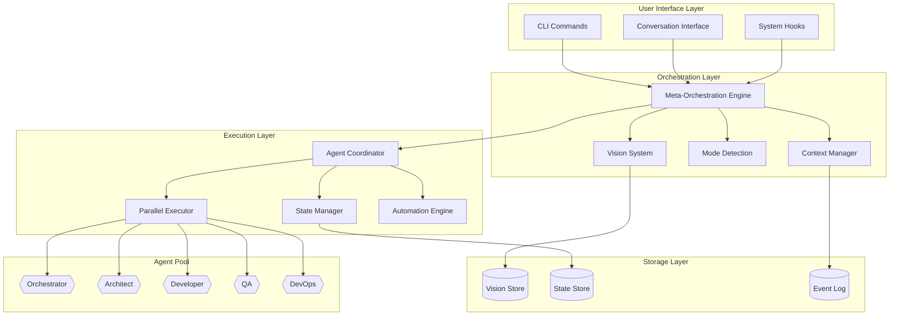
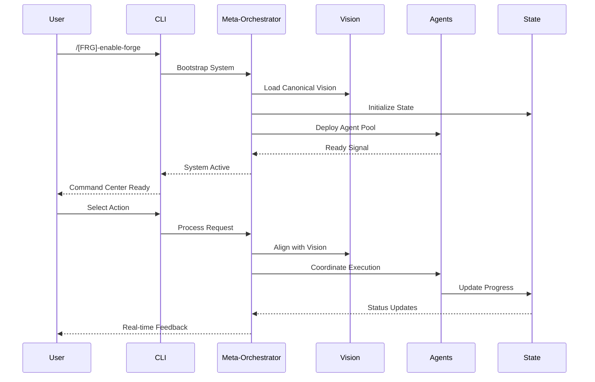

# NXTG-Forge Meta-Orchestration System Architecture
**Version**: 1.0.0
**Status**: Technical Specification
**Date**: 2026-01-24

## Executive Summary

The Meta-Orchestration System transforms NXTG-Forge into an autonomous Chief of Staff for developers, providing intelligent coordination of multiple specialized agents, canonical vision alignment, and context-aware automation. This architecture enables self-bootstrapping from GitHub, parallel agent execution, and seamless state persistence across sessions.

## System Architecture

### Component Overview



### Data Flow Architecture



## Core Components

### 1. Self-Bootstrap System

#### Bootstrap Architecture

```typescript
interface BootstrapConfig {
  source: "github" | "local" | "registry";
  repository: string;
  branch: string;
  version: string;
  checksum?: string;
}

interface BootstrapSequence {
  phases: BootstrapPhase[];
  rollback: RollbackStrategy;
  verification: HealthCheck[];
}

interface BootstrapPhase {
  name: string;
  actions: BootstrapAction[];
  timeout: number;
  retryPolicy: RetryPolicy;
}
```

#### Bootstrap Sequence

```yaml
bootstrap_sequence:
  phase_1_detection:
    - check_existing_installation
    - verify_environment
    - determine_bootstrap_mode

  phase_2_acquisition:
    - clone_repository
    - verify_integrity
    - extract_components

  phase_3_installation:
    - install_plugin_manifest
    - deploy_agents
    - install_commands
    - install_skills
    - configure_hooks

  phase_4_initialization:
    - create_vision_store
    - initialize_state
    - setup_directories
    - configure_permissions

  phase_5_verification:
    - run_health_checks
    - validate_agents
    - test_orchestration
    - confirm_ready_state
```

#### Bootstrap Implementation

```typescript
// .claude/engine/bootstrap.ts
export class ForgeBootstrap {
  private readonly REPO = "https://github.com/nxtg-ai/nxtg-forge";
  private readonly TIMEOUT = 30000; // 30 seconds

  async bootstrap(): Promise<BootstrapResult> {
    const startTime = Date.now();

    try {
      // Phase 1: Detection
      const existing = await this.detectExisting();
      if (existing && !existing.needsUpgrade) {
        return { success: true, mode: "already_installed" };
      }

      // Phase 2: Acquisition
      const components = await this.acquireComponents();

      // Phase 3: Installation
      await this.installComponents(components);

      // Phase 4: Initialization
      await this.initializeSystem();

      // Phase 5: Verification
      const health = await this.verifyHealth();

      const elapsed = Date.now() - startTime;
      return {
        success: health.allPassed,
        mode: existing ? "upgrade" : "fresh",
        time: elapsed,
        health
      };

    } catch (error) {
      await this.rollback();
      throw new BootstrapError("Bootstrap failed", error);
    }
  }

  private async acquireComponents(): Promise<Components> {
    // Clone or download from GitHub
    const tempDir = await this.createTempDir();
    await this.cloneRepo(this.REPO, tempDir);

    return {
      agents: await this.loadAgents(tempDir),
      commands: await this.loadCommands(tempDir),
      skills: await this.loadSkills(tempDir),
      hooks: await this.loadHooks(tempDir),
      manifest: await this.loadManifest(tempDir)
    };
  }

  private async installComponents(components: Components): Promise<void> {
    // Install in correct order with dependency resolution
    await this.installManifest(components.manifest);
    await this.installAgents(components.agents);
    await this.installCommands(components.commands);
    await this.installSkills(components.skills);
    await this.installHooks(components.hooks);
  }
}
```

### 2. Canonical Vision System

#### Vision Schema

```yaml
# .claude/VISION.yaml
canonical_vision:
  meta:
    version: "1.0.0"
    created: "2026-01-24"
    last_modified: "2026-01-24"
    author: "human@example.com"

  project:
    name: "NXTG-Forge"
    mission: "Autonomous Chief of Staff for developers"
    description: |
      Transform exhausting development into empowering creation
      through intelligent orchestration and automation.

  principles:
    - name: "Human-Centric"
      description: "Augment human capability, never replace it"
      priority: 1

    - name: "Transparent"
      description: "All decisions and actions are explainable"
      priority: 2

    - name: "Resilient"
      description: "Gracefully handle failures and uncertainties"
      priority: 3

  strategic_goals:
    - id: "sg-001"
      goal: "Eliminate cognitive overhead"
      metrics:
        - "Time to implement feature < 50% baseline"
        - "Context switches per session < 3"

    - id: "sg-002"
      goal: "Maintain perfect alignment"
      metrics:
        - "Vision drift incidents = 0"
        - "Agent coordination success > 95%"

  current_focus:
    sprint: "alpha-1"
    priority: "Core orchestration system"
    deadline: "2026-02-01"

  alignment_checkpoints:
    - trigger: "major_decision"
      action: "confirm_with_human"

    - trigger: "vision_update"
      action: "propagate_to_agents"

    - trigger: "conflict_detected"
      action: "escalate_resolution"
```

#### Vision Management System

```typescript
// .claude/engine/vision.ts
export class VisionManager {
  private vision: CanonicalVision;
  private history: VisionEvent[] = [];

  async loadVision(): Promise<CanonicalVision> {
    const visionPath = ".claude/VISION.yaml";
    const raw = await this.readFile(visionPath);
    this.vision = this.parseYaml(raw);
    return this.vision;
  }

  async updateVision(update: VisionUpdate): Promise<void> {
    // Event-sourced updates for auditability
    const event: VisionEvent = {
      id: this.generateId(),
      timestamp: new Date(),
      type: update.type,
      before: this.vision,
      after: this.applyUpdate(this.vision, update),
      author: update.author,
      reason: update.reason
    };

    // Append to event log
    this.history.push(event);
    await this.appendToEventLog(event);

    // Update current vision
    this.vision = event.after;
    await this.saveVision(this.vision);

    // Propagate to all agents
    await this.propagateVision();
  }

  async queryVision(query: VisionQuery): Promise<any> {
    // Efficient querying of vision elements
    return this.extractPath(this.vision, query.path);
  }

  async alignWithVision(decision: Decision): Promise<AlignmentResult> {
    // Check if decision aligns with vision
    const principles = this.vision.principles;
    const violations = [];

    for (const principle of principles) {
      if (!this.checkAlignment(decision, principle)) {
        violations.push({
          principle: principle.name,
          reason: this.explainMisalignment(decision, principle)
        });
      }
    }

    return {
      aligned: violations.length === 0,
      violations,
      recommendation: this.suggestAlignment(decision, violations)
    };
  }

  private async propagateVision(): Promise<void> {
    // Notify all agents of vision update
    const agents = await this.getActiveAgents();

    await Promise.all(
      agents.map(agent =>
        this.notifyAgent(agent, {
          type: "vision_update",
          vision: this.vision
        })
      )
    );
  }
}
```

### 3. Meta-Orchestration Engine

#### Orchestration Protocol

```typescript
// .claude/engine/orchestrator.ts
export class MetaOrchestrationEngine {
  private agents: Map<string, Agent> = new Map();
  private tasks: Map<string, Task> = new Map();
  private executors: ExecutorPool;

  async orchestrate(request: OrchestrationRequest): Promise<OrchestrationResult> {
    // Step 1: Understand intent
    const intent = await this.analyzeIntent(request);

    // Step 2: Check vision alignment
    const alignment = await this.visionManager.alignWithVision(intent);
    if (!alignment.aligned) {
      return this.handleMisalignment(alignment);
    }

    // Step 3: Plan execution
    const plan = await this.createExecutionPlan(intent);

    // Step 4: Coordinate agents
    const coordination = await this.coordinateAgents(plan);

    // Step 5: Execute with monitoring
    const result = await this.executeWithMonitoring(coordination);

    // Step 6: Update state
    await this.updateState(result);

    return result;
  }

  async coordinateAgents(plan: ExecutionPlan): Promise<Coordination> {
    const coordination: Coordination = {
      pattern: plan.pattern,
      agents: [],
      dependencies: new Map(),
      timeline: []
    };

    // Determine coordination pattern
    switch (plan.pattern) {
      case "sequential":
        coordination.agents = this.arrangeSequential(plan.steps);
        break;

      case "parallel":
        coordination.agents = this.arrangeParallel(plan.steps);
        break;

      case "iterative":
        coordination.agents = this.arrangeIterative(plan.steps);
        break;

      case "hierarchical":
        coordination.agents = this.arrangeHierarchical(plan.steps);
        break;
    }

    // Build dependency graph
    coordination.dependencies = this.buildDependencyGraph(plan.steps);

    // Create execution timeline
    coordination.timeline = this.createTimeline(
      coordination.agents,
      coordination.dependencies
    );

    return coordination;
  }

  async executeParallel(agents: Agent[], context: Context): Promise<Result[]> {
    // Execute multiple agents simultaneously
    const promises = agents.map(agent =>
      this.executeAgent(agent, context)
        .then(result => ({ agent: agent.id, result, success: true }))
        .catch(error => ({ agent: agent.id, error, success: false }))
    );

    const results = await Promise.allSettled(promises);

    // Aggregate results
    return this.aggregateResults(results);
  }

  private async executeAgent(agent: Agent, context: Context): Promise<AgentResult> {
    // Use Claude's Task tool for agent execution
    const task = {
      tool: "Task",
      parameters: {
        agent: agent.path,
        context: this.serializeContext(context),
        timeout: agent.timeout || 120000
      }
    };

    const result = await this.invokeTask(task);

    return {
      agentId: agent.id,
      output: result.output,
      metrics: result.metrics,
      artifacts: result.artifacts
    };
  }
}
```

#### Coordination Patterns

```typescript
// Coordination Pattern Implementations
export class CoordinationPatterns {
  // Pattern 1: Sequential with Sign-Off
  async sequentialWithSignOff(steps: Step[]): Promise<Result> {
    let context = {};

    for (const step of steps) {
      const result = await this.execute(step, context);

      if (step.requiresSignOff) {
        const signOff = await this.requestSignOff(result);
        if (!signOff.approved) {
          return this.handleRejection(signOff);
        }
      }

      context = this.updateContext(context, result);
    }

    return this.finalizeSequence(context);
  }

  // Pattern 2: Parallel Execution
  async parallelExecution(agents: Agent[]): Promise<Result[]> {
    const batchSize = 5; // Max parallel executions
    const results = [];

    for (let i = 0; i < agents.length; i += batchSize) {
      const batch = agents.slice(i, i + batchSize);
      const batchResults = await Promise.all(
        batch.map(agent => this.executeWithRetry(agent))
      );
      results.push(...batchResults);
    }

    return this.synthesizeResults(results);
  }

  // Pattern 3: Iterative Refinement
  async iterativeRefinement(
    architect: Agent,
    builder: Agent,
    maxIterations: number = 3
  ): Promise<Result> {
    let design = await this.execute(architect, { mode: "initial" });
    let implementation;

    for (let i = 0; i < maxIterations; i++) {
      implementation = await this.execute(builder, { design });

      const review = await this.execute(architect, {
        mode: "review",
        implementation
      });

      if (review.approved) break;

      design = await this.execute(architect, {
        mode: "refine",
        feedback: review.feedback
      });
    }

    return implementation;
  }

  // Pattern 4: Meta-Bootstrap
  async metaBootstrap(): Promise<SystemUpdate> {
    // Self-analysis
    const analysis = await this.analyzeSystem();

    // Generate improvements
    const improvements = await this.generateImprovements(analysis);

    // Create new agents if needed
    const newAgents = await this.generateAgents(improvements);

    // Deploy updates
    const deployment = await this.deployUpdates({
      agents: newAgents,
      improvements
    });

    return deployment;
  }
}
```

### 4. Role-Based Engagement System

#### Mode Detection and Adaptation

```typescript
// .claude/engine/modes.ts
export class ModeDetector {
  private currentMode: EngagementMode = "engineer"; // default
  private modeHistory: ModeTransition[] = [];

  async detectMode(input: UserInput): Promise<EngagementMode> {
    // Analyze input patterns
    const indicators = this.extractIndicators(input);

    // Score each mode
    const scores = {
      ceo: this.scoreCEO(indicators),
      vp: this.scoreVP(indicators),
      engineer: this.scoreEngineer(indicators),
      builder: this.scoreBuilder(indicators),
      founder: this.scoreFounder(indicators)
    };

    // Select highest scoring mode
    const detectedMode = this.selectMode(scores);

    // Record transition if changed
    if (detectedMode !== this.currentMode) {
      this.recordTransition(this.currentMode, detectedMode);
      this.currentMode = detectedMode;
    }

    return detectedMode;
  }

  private extractIndicators(input: UserInput): Indicators {
    return {
      abstraction: this.measureAbstraction(input.text),
      technical: this.measureTechnicalDepth(input.text),
      strategic: this.detectStrategicLanguage(input.text),
      implementation: this.detectImplementationFocus(input.text),
      timeHorizon: this.estimateTimeHorizon(input.text),
      previousContext: input.context
    };
  }

  getBehaviorMatrix(): BehaviorMatrix {
    return {
      ceo: {
        interaction: "vision_focused",
        details: "minimal",
        updates: "executive_summary",
        decisions: "strategic_only",
        automation: "maximum"
      },
      vp: {
        interaction: "oversight_focused",
        details: "moderate",
        updates: "progress_reports",
        decisions: "architectural",
        automation: "high"
      },
      engineer: {
        interaction: "technical_focused",
        details: "comprehensive",
        updates: "detailed_logs",
        decisions: "implementation",
        automation: "moderate"
      },
      builder: {
        interaction: "hands_on",
        details: "code_level",
        updates: "real_time",
        decisions: "all_levels",
        automation: "assisted"
      },
      founder: {
        interaction: "full_spectrum",
        details: "adaptive",
        updates: "customized",
        decisions: "contextual",
        automation: "intelligent"
      }
    };
  }
}

export class ModeAdapter {
  adapt(mode: EngagementMode, response: Response): Response {
    const behavior = this.getBehavior(mode);

    return {
      ...response,
      detail: this.adjustDetail(response, behavior.details),
      formatting: this.adjustFormatting(response, behavior.interaction),
      automation: this.adjustAutomation(response, behavior.automation),
      nextSteps: this.suggestNextSteps(mode, response.context)
    };
  }
}
```

### 5. YOLO Mode - Intelligent Automation

#### Automation Decision Framework

```typescript
// .claude/engine/automation.ts
export class AutomationEngine {
  private confidenceThreshold = 0.85;
  private automationLevel: number = 3; // 1-5 scale

  async shouldAutomate(action: Action): Promise<AutomationDecision> {
    // Calculate confidence score
    const confidence = await this.calculateConfidence(action);

    // Check guardrails
    const guardrails = await this.checkGuardrails(action);
    if (guardrails.blocked) {
      return { automate: false, reason: guardrails.reason };
    }

    // Determine automation level
    const level = this.getAutomationLevel(action, confidence);

    return {
      automate: confidence >= this.confidenceThreshold,
      level,
      confidence,
      requiresConfirmation: level <= 2,
      logging: level <= 3 ? "verbose" : "summary"
    };
  }

  private async calculateConfidence(action: Action): Promise<number> {
    const factors = {
      precedent: await this.checkPrecedent(action), // 0.3 weight
      risk: await this.assessRisk(action), // 0.3 weight
      clarity: await this.assessClarity(action), // 0.2 weight
      reversibility: await this.checkReversibility(action), // 0.2 weight
    };

    return (
      factors.precedent * 0.3 +
      factors.risk * 0.3 +
      factors.clarity * 0.2 +
      factors.reversibility * 0.2
    );
  }

  private getAutomationLevel(action: Action, confidence: number): number {
    if (action.type === "destructive") return 1; // Always ask
    if (confidence < 0.6) return 1; // Suggest
    if (confidence < 0.75) return 2; // Inform
    if (confidence < 0.85) return 3; // Silent
    if (confidence < 0.95) return 4; // Proactive
    return 5; // Meta
  }

  async executeWithRollback(action: Action): Promise<ExecutionResult> {
    // Create rollback point
    const checkpoint = await this.createCheckpoint();

    try {
      // Execute action
      const result = await this.execute(action);

      // Verify success
      if (!result.success) {
        await this.rollback(checkpoint);
        return { ...result, rolled_back: true };
      }

      return result;

    } catch (error) {
      // Automatic rollback on error
      await this.rollback(checkpoint);
      throw new AutomationError("Execution failed, rolled back", error);
    }
  }

  private guardrails: Guardrail[] = [
    { pattern: /rm -rf/, action: "block", reason: "Destructive command" },
    { pattern: /sudo/, action: "confirm", reason: "Elevated privileges" },
    { pattern: /production/, action: "confirm", reason: "Production environment" },
    { pattern: /DELETE|DROP/, action: "confirm", reason: "Data deletion" },
    { pattern: /\.env|secret|password/, action: "block", reason: "Sensitive data" }
  ];
}
```

### 6. Context Continuity System

#### State Persistence Architecture

```typescript
// .claude/engine/context.ts
export class ContextManager {
  private state: SystemState;
  private graph: ContextGraph;

  async saveState(): Promise<void> {
    const stateFile = ".claude/state.json";
    const state: SystemState = {
      version: "1.0.0",
      timestamp: new Date().toISOString(),
      session: {
        id: this.sessionId,
        start: this.sessionStart,
        mode: this.currentMode
      },
      context: {
        currentTask: this.currentTask,
        taskStack: this.taskStack,
        completedTasks: this.completedTasks
      },
      progress: {
        overall: this.calculateOverallProgress(),
        byFeature: this.progressByFeature,
        blockers: this.identifyBlockers()
      },
      vision: {
        alignment: this.visionAlignment,
        focus: this.currentFocus
      },
      agents: {
        active: Array.from(this.activeAgents.keys()),
        history: this.agentHistory
      }
    };

    await this.writeJson(stateFile, state);

    // Also save to event log for history
    await this.appendToEventLog({
      type: "state_snapshot",
      state
    });
  }

  async restoreContext(): Promise<RestorationResult> {
    try {
      // Load saved state
      const state = await this.loadState();

      // Rebuild context graph
      this.graph = await this.rebuildGraph(state);

      // Restore task context
      const tasks = await this.restoreTasks(state.context);

      // Generate summary
      const summary = this.generateContextSummary(state, tasks);

      // Provide intelligent recommendations
      const recommendations = await this.generateRecommendations(state);

      return {
        success: true,
        summary,
        recommendations,
        state
      };

    } catch (error) {
      // Graceful degradation if no state exists
      return {
        success: false,
        summary: "Starting fresh session",
        recommendations: ["Run /[FRG]-init to initialize"],
        state: this.getDefaultState()
      };
    }
  }

  private buildContextGraph(): ContextGraph {
    // Build relationship graph of tasks, features, and vision
    const graph = new Graph();

    // Add vision as root
    graph.addNode("vision", this.vision);

    // Add strategic goals
    this.vision.strategicGoals.forEach(goal => {
      graph.addNode(goal.id, goal);
      graph.addEdge("vision", goal.id, "contains");
    });

    // Add features
    this.features.forEach(feature => {
      graph.addNode(feature.id, feature);
      graph.addEdge(feature.goalId, feature.id, "implements");
    });

    // Add tasks
    this.tasks.forEach(task => {
      graph.addNode(task.id, task);
      graph.addEdge(task.featureId, task.id, "requires");

      // Add dependencies
      task.dependencies.forEach(dep => {
        graph.addEdge(task.id, dep, "depends_on");
      });
    });

    return graph;
  }

  async generateProgressVisualization(): Promise<string> {
    const progress = await this.calculateProgress();

    return `
╭─ PROGRESS OVERVIEW ──────────────────────────────╮
│                                                   │
│  Current Sprint: ${progress.sprint}              │
│  Overall Progress: ${this.renderProgressBar(progress.overall)}
│                                                   │
│  Features Completed: ${progress.featuresCompleted}/${progress.featuresTotal}
│  Tasks Completed: ${progress.tasksCompleted}/${progress.tasksTotal}
│  Current Focus: ${progress.currentFocus}         │
│                                                   │
│  Active Agents: ${progress.activeAgents.join(", ")}
│  Time in Session: ${progress.sessionTime}        │
│                                                   │
│  Next Recommended Action:                        │
│  → ${progress.nextAction}                        │
│                                                   │
╰───────────────────────────────────────────────────╯
    `;
  }
}
```

## Implementation Blueprint

### Phase 1: Foundation (Week 1)

1. **Bootstrap System**
   - Implement GitHub clone mechanism
   - Create plugin manifest installer
   - Build health check system
   - Implement rollback mechanism

2. **Vision System**
   - Create vision schema
   - Implement vision loader
   - Build vision query API
   - Create propagation system

3. **State Management**
   - Design state schema
   - Implement persistence layer
   - Create event log system
   - Build recovery mechanism

### Phase 2: Orchestration (Week 2)

1. **Meta-Orchestration Engine**
   - Implement coordination patterns
   - Build parallel execution system
   - Create dependency resolver
   - Implement monitoring system

2. **Agent Communication**
   - Define agent protocol
   - Implement message passing
   - Build result aggregation
   - Create error handling

3. **Context Management**
   - Build context graph
   - Implement restoration system
   - Create progress tracking
   - Build recommendation engine

### Phase 3: Intelligence (Week 3)

1. **Mode Detection**
   - Implement detection algorithm
   - Build behavior matrix
   - Create adaptation system
   - Implement transitions

2. **Automation Engine**
   - Build confidence scoring
   - Implement guardrails
   - Create rollback system
   - Build learning mechanism

3. **Integration**
   - Connect all components
   - Implement end-to-end flows
   - Create monitoring dashboard
   - Build debugging tools

## Plugin Manifest Structure

```json
{
  "name": "nxtg-forge",
  "version": "3.0.0",
  "description": "Meta-Orchestration System for Development",
  "author": "NXTG.ai",
  "repository": "https://github.com/nxtg-ai/nxtg-forge",

  "bootstrap": {
    "command": "[FRG]-enable-forge",
    "source": "github",
    "branch": "main",
    "timeout": 30000
  },

  "components": {
    "agents": [
      {
        "id": "orchestrator",
        "path": "agents/[AFRG]-orchestrator.md",
        "priority": 1,
        "capabilities": ["coordination", "planning", "decision"]
      }
    ],
    "commands": [
      {
        "name": "[FRG]-init",
        "path": "commands/[FRG]-init.md",
        "description": "Initialize NXTG-Forge"
      }
    ],
    "skills": [
      {
        "name": "architecture",
        "path": "skills/architecture.md"
      }
    ],
    "hooks": [
      {
        "event": "session-start",
        "path": "hooks/session-start.md"
      }
    ]
  },

  "configuration": {
    "vision": {
      "path": ".claude/VISION.yaml",
      "schema": "schemas/vision.schema.json"
    },
    "state": {
      "path": ".claude/state.json",
      "schema": "schemas/state.schema.json"
    },
    "settings": {
      "automationLevel": 3,
      "parallelExecution": true,
      "maxConcurrentAgents": 5
    }
  },

  "requirements": {
    "claudeCode": ">=1.0.0",
    "node": ">=18.0.0"
  }
}
```

## Error Handling and Recovery

### Error Recovery Strategy

```typescript
export class ErrorRecovery {
  async handleError(error: SystemError): Promise<RecoveryResult> {
    // Classify error severity
    const severity = this.classifySeverity(error);

    switch (severity) {
      case "critical":
        // System-wide failure
        await this.emergencyShutdown();
        await this.notifyHuman(error);
        return { recovered: false, action: "manual_intervention" };

      case "high":
        // Component failure
        await this.isolateComponent(error.component);
        await this.attemptRestart(error.component);
        return { recovered: true, action: "component_restart" };

      case "medium":
        // Task failure
        await this.retryWithBackoff(error.task);
        return { recovered: true, action: "retry" };

      case "low":
        // Recoverable error
        await this.logAndContinue(error);
        return { recovered: true, action: "continue" };
    }
  }
}
```

## Performance Considerations

### Optimization Strategies

1. **Lazy Loading**: Load agents only when needed
2. **Caching**: Cache vision queries and state reads
3. **Batching**: Batch agent communications
4. **Streaming**: Stream large results instead of buffering
5. **Indexing**: Index context graph for fast queries

### Performance Targets

- Bootstrap: < 30 seconds
- Agent spawn: < 500ms
- State save: < 100ms
- Context restore: < 2 seconds
- Vision query: < 10ms

## Security Considerations

1. **Input Validation**: All user input sanitized
2. **Command Injection**: Guardrails prevent dangerous commands
3. **State Integrity**: Checksums verify state files
4. **Vision Protection**: Vision updates require authentication
5. **Audit Trail**: All actions logged with attribution

## Extension Points

### Future Capabilities

1. **Plugin System**: Third-party agent integration
2. **Custom Patterns**: User-defined coordination patterns
3. **ML Integration**: Learning from usage patterns
4. **Cloud Sync**: Multi-device state synchronization
5. **Team Features**: Multi-user collaboration

## Conclusion

This architecture provides a solid foundation for the NXTG-Forge Meta-Orchestration System. It enables self-bootstrapping, intelligent agent coordination, and seamless context management while maintaining simplicity and extensibility. The system can evolve from this foundation to support increasingly sophisticated automation and intelligence capabilities.

**Next Steps:**
1. Review and validate architecture with team
2. Create detailed implementation plan
3. Begin Phase 1 implementation
4. Set up continuous integration pipeline
5. Prepare documentation and examples