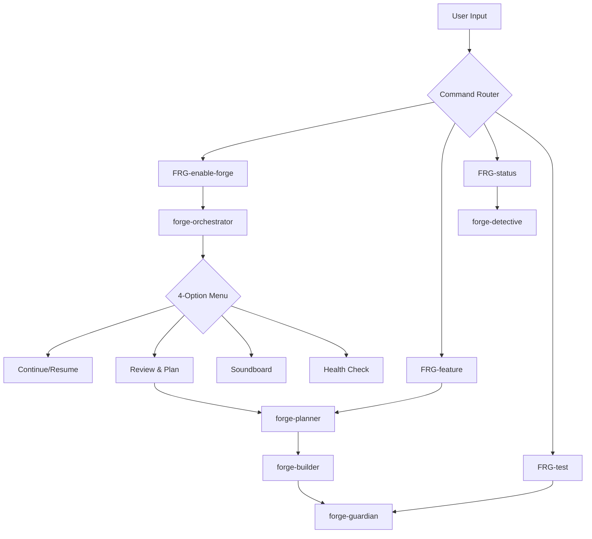

# v2 to v3 Agent Migration Strategy

## Executive Implementation Guide

**Goal**: Restore ThreeDB v2's production-ready agent capabilities to NXTG-Forge v3 in 2-4 hours.

## Quick Start (Option A - Recommended)

### Step 1: Backup Current v3 Agents (5 minutes)
```bash
cd /home/axw/projects/NXTG-Forge/v3
mkdir -p .claude/agents-v3-backup
cp .claude/agents/*.md .claude/agents-v3-backup/
```

### Step 2: Migrate v2 Agents (10 minutes)
```bash
# Copy all v2 agents
cp /home/axw/projects/threedb/.claude/agents/agent-forge-*.md \
   .claude/agents/

# Preserve v3's DevOps agent (it's good)
cp .claude/agents-v3-backup/devops.md .claude/agents/forge-devops.md
```

### Step 3: Update Command Integration (30 minutes)

#### Update [FRG]-enable-forge Command
```markdown
# In .claude/commands/[FRG]-enable-forge.md
Replace current content with:

Launch the NXTG-Forge Orchestrator to activate the command center.

Use the Task tool to invoke the forge-orchestrator agent, which will:
1. Present the canonical 4-option menu
2. Handle user selection
3. Route to appropriate specialist agents
4. Manage state and context

Task: forge-orchestrator
```

#### Update [FRG]-feature Command
```markdown
# In .claude/commands/[FRG]-feature.md
Add routing to Planner:

For feature planning and implementation:
1. Use Task tool to invoke forge-planner for architecture design
2. After planning, coordinate with forge-builder for implementation
3. Finish with forge-guardian for quality validation

Primary Task: forge-planner
Secondary Tasks: forge-builder, forge-guardian
```

#### Update [FRG]-status Command
```markdown
# In .claude/commands/[FRG]-status.md
Enhance with Detective:

For comprehensive project status:
1. Use Task tool to invoke forge-detective for health analysis
2. Generate health score (0-100)
3. Show metrics dashboard
4. Provide actionable recommendations

Task: forge-detective
```

### Step 4: Implement State Management (20 minutes)

Create state configuration:
```bash
cat > .claude/forge-state.json << 'EOF'
{
  "version": "3.0",
  "session": {
    "id": null,
    "started": null,
    "branch": null,
    "command_prefix": "[FRG]",
    "last_command": null,
    "progress": 0
  },
  "agents": {
    "orchestrator": "forge-orchestrator",
    "planner": "forge-planner",
    "builder": "forge-builder",
    "detective": "forge-detective",
    "guardian": "forge-guardian",
    "devops": "forge-devops",
    "sentinel": "forge-release-sentinel"
  },
  "checkpoints": [],
  "context": {}
}
EOF
```

### Step 5: Test Integration (30 minutes)

Run validation sequence:
```bash
# Test orchestration menu
/[FRG]-enable-forge

# Test feature planning
/[FRG]-feature "Add user authentication"

# Test health analysis
/[FRG]-status

# Test quality gates
/[FRG]-test
```

## Architecture Integration Map

### Agent Mapping

| v3 Agent | v2 Replacement | Role | Integration |
|----------|---------------|------|-------------|
| orchestrator.md | agent-forge-orchestrator.md | Master Coordinator | Primary entry point via [FRG]-enable-forge |
| architect.md | agent-forge-planner.md | Strategic Planning | Called for [FRG]-feature design phase |
| developer.md | agent-forge-builder.md | Implementation | Executes after planning phase |
| qa.md | agent-forge-guardian.md | Quality Assurance | Validates all implementations |
| devops.md | forge-devops.md (keep v3) | DevOps/Deploy | Enhanced with v2 patterns |
| (missing) | agent-forge-detective.md | Health Analysis | Powers [FRG]-status command |
| (missing) | forge-release-sentinel.md | Release Mgmt | Handles [FRG]-deploy validation |

### Command Flow Architecture



## Critical Success Factors

### 1. Preserve v2's Operational Excellence

**DO**:
- Keep ALL v2 automation (test generation, security scanning)
- Maintain the canonical 4-option menu exactly
- Preserve agent handoff protocols ("Forge {Agent} {action}...")
- Keep Result<T, Error> type patterns

**DON'T**:
- Simplify to the point of losing functionality
- Mix v3's conceptual approach with v2's operational approach
- Break the state management system

### 2. Enhance with v3 Improvements

**Keep from v3**:
- DevOps agent (genuinely good addition)
- [FRG]- command prefix (better than nxtg-)
- Simplified directory structure

**Discard from v3**:
- Generic conceptual guidelines
- Manual checklists without automation
- Vague coordination patterns

### 3. Integration Points

**Command Hooks**:
```javascript
// When [FRG]-enable-forge is called
1. Launch forge-orchestrator
2. Present canonical menu
3. Route to selected option
4. Maintain state throughout

// When [FRG]-feature is called
1. Launch forge-planner for design
2. Get user approval
3. Launch forge-builder for implementation
4. Launch forge-guardian for validation
5. Update state with progress

// When [FRG]-status is called
1. Launch forge-detective
2. Analyze project health
3. Generate score (0-100)
4. Show actionable recommendations
```

## Rollback Plan

If issues arise:
```bash
# Restore v3 agents
cd /home/axw/projects/NXTG-Forge/v3
rm .claude/agents/*.md
cp .claude/agents-v3-backup/*.md .claude/agents/

# Reset state
rm .claude/forge-state.json
```

## Validation Checklist

### Immediate Validation (After Migration)
- [ ] Orchestrator menu appears with 4 options
- [ ] Each menu option routes correctly
- [ ] Agent handoffs show "Forge {Agent} {action}..."
- [ ] State persists between commands

### Functional Validation
- [ ] Feature planning generates architecture
- [ ] Task breakdown includes dependencies
- [ ] Health check shows 0-100 score
- [ ] Quality gates run automatically
- [ ] Test generation works
- [ ] Security scanning executes

### Integration Validation
- [ ] [FRG]- commands trigger correct agents
- [ ] DevOps agent integrates with v2 agents
- [ ] State management tracks progress
- [ ] Context restoration works

## Timeline

| Phase | Duration | Outcome |
|-------|----------|---------|
| Backup | 5 min | Safety net created |
| Migration | 10 min | v2 agents in place |
| Integration | 30 min | Commands connected |
| State Setup | 20 min | Persistence enabled |
| Testing | 30 min | Validation complete |
| **Total** | **95 min** | **Full restoration** |

## Post-Migration Enhancements

Once core migration is complete:

1. **Week 1**: Fine-tune agent interactions
2. **Week 2**: Enhance state management with more context
3. **Week 3**: Add custom workflows for your team
4. **Week 4**: Create team-specific agents

## Success Metric

You'll know the migration succeeded when:
- Running `/[FRG]-enable-forge` shows the 4-option menu
- Selecting option 2 launches strategic planning with task breakdown
- Selecting option 4 shows a health score with specific recommendations
- The system generates actual tests, not just describes testing pyramids

---

*"Architecture is not about the components you have, but how they work together. v2 agents work together; v3 agents merely coexist."*