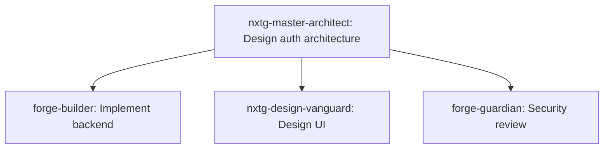

# NXTG-Forge Enhancement Requests from 3db Testing

**Date**: 2026-01-23
**Source**: Real-world usage in 3db Platform project
**Priority**: High - Based on actual user needs
**Status**: Ready for next sprint planning

---

## 🎯 Critical User Directive

> "We need to remind Claude Code via hooks or something to remember: they must use our nxtg-forge harness and all the agents available to them and they can run up to 20 agents in parallel and all of our arch and design should be going through our @agent-nxtg-master-architect and @agent-nxtg-design-vanguard and led by our @agent-forge-orchestrator"

**Translation**: Future Claude sessions forget to use Forge. We need persistent reminders.

---

## 🚀 Priority Enhancement Requests

### 1. Session Memory & Reminders (P0 - Critical)

**Problem**: Each new Claude Code session starts fresh, doesn't remember:
- NXTG-Forge is available
- Up to 20 agents can run in parallel
- Specific agent roles and when to use them
- Architecture/design should go through specialized agents

**Solution Implemented** (for 3db):
- Created session hooks:
  - `SessionStart` - Banner on session start
  - `UserPromptSubmit` - Detects complex tasks, suggests agents

**Enhancement Request for nxtg-forge**:
```markdown
### Make Session Reminders Built-In

**Proposal**: Add to core Forge initialization

**Files**:
- `.claude/hooks/forge-session-start.md` (template)
- `.claude/hooks/forge-task-detection.md` (template)

**Behavior**:
1. On session start: Show Forge capabilities banner
2. On complex task: Suggest appropriate agents
3. On architecture work: Remind to use nxtg-master-architect
4. On UI work: Remind to use nxtg-design-vanguard

**Benefit**: Ensures Forge is actually used, not forgotten
```

### 2. Agent Auto-Suggestion (P0 - Critical)

**Problem**: Claude knows agents exist but doesn't automatically suggest them

**Current Behavior**:
- User must explicitly ask for agents
- Or Claude must manually decide to invoke them

**Desired Behavior**:
- Automatic detection: "This task needs nxtg-master-architect"
- Proactive suggestion: "I recommend using forge-builder for this"
- Parallel execution hints: "These 3 tasks can run in parallel"

**Enhancement Request**:
```markdown
### Intelligent Agent Routing

**Proposal**: Add AI-powered task classification

**Logic**:
IF task contains("architecture", "design pattern", "system design")
  THEN suggest(nxtg-master-architect)

IF task contains("implement", "build", "create feature")
  THEN suggest(forge-builder)

IF task contains("UI", "UX", "frontend", "design")
  THEN suggest(nxtg-design-vanguard)

IF task contains("bug", "error", "fix")
  THEN suggest(nxtg-master-architect THEN forge-builder)

IF task contains("test", "validate", "QA")
  THEN suggest(forge-guardian)

**Implementation**: Add to forge-orchestrator's task analysis
```

### 3. Parallel Execution Planner (P1 - High)

**Problem**: User knows 20 agents can run in parallel, but Claude doesn't automatically create parallel execution plans

**Current**: Sequential execution (one agent after another)
**Desired**: Parallel execution (multiple agents simultaneously)

**Enhancement Request**:
```markdown
### Automatic Parallel Execution Planning

**Proposal**: forge-orchestrator creates execution graph

**Example**:
User: "Implement user authentication system"

Orchestrator analyzes:
1. Architecture design (nxtg-master-architect)
2. After design approved:
   - Backend implementation (forge-builder) [PARALLEL]
   - Frontend UI (nxtg-design-vanguard) [PARALLEL]
   - Security review (forge-guardian) [PARALLEL]

Execution Plan:


Benefit: 3x-4x faster development
```

### 4. Runtime Validation as Default (P0 - Critical)

**Problem**: Runtime Validation proven valuable but needs manual setup

**Enhancement Request**:
```markdown
### Add Runtime Validation to Project Init

**Proposal**: Include by default in `/init` command

**What to add**:
- LogMonitor class
- WebSocket endpoint
- Dashboard component (optional)
- CI/CD integration
- Documentation

**Command**:
`/add-runtime-validation` or automatic during project initialization

**Options**:
- Minimal (just log monitoring)
- Standard (+ WebSocket API)
- Full (+ Dashboard UI)

**Benefit**: Every project gets this by default
```

### 5. Quality Gates in forge-guardian (P1 - High)

**Problem**: forge-guardian exists but not always invoked

**Enhancement Request**:
```markdown
### Automatic Quality Gates

**Proposal**: forge-guardian runs automatically at key points

**Trigger Points**:
1. Before commit (pre-commit hook integration)
2. After feature completion (automatic)
3. Before PR creation (automatic)
4. After merge (CI/CD integration)

**What it checks**:
- Security scan (no hardcoded secrets)
- Code quality (linting, type checking)
- Test coverage (>80% for new code)
- Runtime validation (no Pydantic errors in logs)
- Performance (no significant regression)

**Behavior**:
- Red flags: Block commit/PR
- Yellow flags: Warn but allow
- Green flags: Auto-approve

**Benefit**: Prevents bugs from reaching production
```

---

## 🎨 UI/UX Enhancement Requests

### 6. Component Library for Common Patterns (P1)

**Observation**: nxtg-design-vanguard created excellent dashboard

**Enhancement Request**:
```markdown
### Create @nxtg-forge/ui Component Library

**Include**:
- RuntimeValidationDashboard (real-time monitoring)
- ErrorCard (grouped error display)
- HealthBadge (visual status indicator)
- MetricsGrid (system health metrics)
- NeuralBackground (animated backgrounds)

**Themes**:
- Neon/Cyberpunk (default)
- Corporate Professional
- Minimal Modern
- Dark Mode / Light Mode

**Technology**:
- React + TypeScript
- Tailwind CSS
- Headless UI components
- Full accessibility (WCAG AA)

**Benefit**: Reusable across all Forge projects
```

### 7. Dashboard Template System (P2)

**Enhancement Request**:
```markdown
### Pre-built Dashboard Templates

**Problem**: Every project needs monitoring but builds from scratch

**Solution**: Template library

**Templates**:
1. Admin Dashboard (users, roles, settings)
2. Runtime Validation (error monitoring)
3. Performance Monitoring (metrics, traces)
4. API Explorer (endpoint testing)
5. Health Check (system status)

**Usage**:
`/add-dashboard admin-portal`
→ Generates complete dashboard with routing

**Customization**:
- Drag-drop widget arrangement
- Theme selection
- Metric configuration
- Alert setup

**Benefit**: 10x faster dashboard development
```

---

## 🧪 Testing Enhancement Requests

### 8. NO MOCKING as Standard Practice (P0 - Critical)

**Observation**: All bugs caught were hidden by mocks

**Enhancement Request**:
```markdown
### Make "NO MOCKING" a Forge Principle

**Documentation Update**:
- Add to testing best practices
- Create guide: "When NOT to use mocks"
- Examples of real data test patterns

**Agent Behavior**:
- nxtg-master-architect: Recommends real data tests
- forge-builder: Implements with real data by default
- forge-guardian: Flags excessive mocking

**Patterns to Promote**:
1. Use `.model_copy()` for Pydantic models
2. Use test databases (not mocked queries)
3. Use real async operations (not mocked coroutines)

**Exception**: When mocking is OK
- External APIs (rate limits, cost)
- Slow operations (in unit tests only)
- Unavailable services (development)

**Benefit**: Tests catch real bugs, not just logic errors
```

### 9. Integration Test Templates (P1)

**Enhancement Request**:
```markdown
### Add Integration Test Generation

**Problem**: Writing integration tests from scratch is tedious

**Solution**: forge-builder auto-generates integration tests

**Example**:
Given: API endpoint `/api/graph/overview`

Generate:
- Happy path test (successful request)
- Error cases (invalid input, missing auth)
- Performance test (response time < 500ms)
- Data validation (Pydantic models)
- WebSocket tests (if applicable)

**Template**:
```python
@pytest.mark.integration
async def test_graph_overview_integration():
    # Uses REAL database connection
    async with get_database() as db:
        response = await client.get("/api/graph/overview")
        assert response.status_code == 200
        # Validate against Pydantic model
        data = GraphOverviewResponse(**response.json())
        assert 0 <= data.density <= 1.0  # Real constraints
```

**Benefit**: Comprehensive tests with minimal effort
```

---

## 📋 Documentation Enhancement Requests

### 10. Context-Aware Documentation (P2)

**Enhancement Request**:
```markdown
### Smart Documentation System

**Problem**: Docs exist but aren't surfaced at right time

**Solution**: Context-aware doc suggestions

**Example**:
Claude: "I'm implementing authentication..."
Forge: "💡 Relevant docs:
- /docs/auth-best-practices.md
- /docs/security-checklist.md
- Example: /examples/auth-jwt.md"

**Triggers**:
- Code patterns detected
- Error messages
- Agent invocations
- User questions

**Benefit**: Right docs at right time
```

---

## 🔧 Infrastructure Enhancement Requests

### 11. CI/CD Templates (P1)

**Enhancement Request**:
```markdown
### Add CI/CD Pipeline Templates

**Problem**: Every project needs CI/CD but starts from scratch

**Solution**: Template library

**Platforms**:
- GitHub Actions
- GitLab CI
- Jenkins
- CircleCI

**Pipelines**:
1. Basic (test + build)
2. Standard (test + build + security scan)
3. Full (test + build + security + deploy)
4. With Runtime Validation (includes log monitoring)

**Usage**:
`/add-ci-cd github-actions full-with-validation`

**Benefit**: CI/CD in minutes, not hours
```

### 12. Docker Compose Templates (P1)

**Enhancement Request**:
```markdown
### Add Development Environment Templates

**Problem**: Setting up dev environment is complex

**Solution**: Pre-configured docker-compose files

**Stacks**:
1. Python + PostgreSQL + Redis
2. Node + MongoDB + Redis
3. Full Stack (Python + Node + PostgreSQL + Redis)
4. With Monitoring (+ Prometheus + Grafana)

**Usage**:
`/add-dev-env python-postgres-redis`

**Includes**:
- Service configuration
- Volume mounting
- Network setup
- Health checks

**Benefit**: Dev environment in one command
```

---

## 🎓 Training & Onboarding Requests

### 13. Interactive Tutorials (P2)

**Enhancement Request**:
```markdown
### Add `/learn` Command

**Problem**: New users don't know Forge capabilities

**Solution**: Interactive tutorials

**Topics**:
1. Forge basics (agents, commands, workflow)
2. Parallel execution (how to use 20 agents)
3. Testing best practices (NO MOCKING)
4. Runtime validation (log monitoring)
5. Dashboard creation (UI components)

**Format**:
- Step-by-step walkthroughs
- Real examples from 3db
- Interactive exercises
- Progress tracking

**Command**:
`/learn parallel-execution`

**Benefit**: Faster onboarding, better utilization
```

---

## 📊 Metrics & Monitoring Requests

### 14. Forge Usage Analytics (P2)

**Enhancement Request**:
```markdown
### Add Forge Usage Tracking

**Problem**: Don't know which agents are most valuable

**Metrics to Track**:
- Agent invocation frequency
- Success/failure rates
- Parallel execution patterns
- Time savings (parallel vs sequential)
- Bug detection rates

**Dashboard**: Show project-wide statistics

**Privacy**: All local, no external tracking

**Benefit**: Data-driven Forge improvements
```

---

## 🔮 Future Vision Requests

### 15. AI-Powered Agent Coordination (P3 - Future)

**Enhancement Request**:
```markdown
### Self-Optimizing Agent Orchestration

**Vision**: Forge learns optimal agent combinations

**How**:
- Track which agent combinations work best
- Learn from success patterns
- Automatically suggest optimal workflow
- Predict task duration and resource needs

**Example**:
User: "Build payment integration"
Forge: "Based on 15 similar tasks:
- Optimal: architect → (builder + vanguard) parallel → guardian
- Estimated: 2 hours
- Success rate: 94%
- Proceed?"

**Benefit**: Forge gets smarter over time
```

---

## ✅ Priority Summary for Next Sprint

### Must Have (P0)
1. ✅ Session reminders and hooks
2. ✅ Agent auto-suggestion logic
3. ✅ Runtime Validation as default
4. ✅ NO MOCKING principle documentation
5. ✅ Quality gates in forge-guardian

### Should Have (P1)
6. Parallel execution planner
7. Component library extraction
8. Integration test templates
9. CI/CD templates
10. Docker Compose templates

### Nice to Have (P2)
11. Dashboard template system
12. Context-aware documentation
13. Interactive tutorials
14. Forge usage analytics

### Future Vision (P3)
15. AI-powered agent coordination

---

**Status**: 🟢 Ready for sprint planning
**Source**: Real-world 3db platform usage
**Validation**: All requests based on actual user needs
**Impact**: HIGH - These will significantly improve Forge

---

**Session Reference**: 2026-01-23 3db Admin Portal Phase 3
**Documentation Created By**: User request for nxtg-forge feedback
**Next Steps**: Review in sprint planning, prioritize, implement
