# 🏆 UX Decision Victory: `/nxtg-*` Command Prefix

## Executive Summary

**Decision**: `/nxtg-*` prefix for ALL NXTG-Forge commands
**Status**: ✅ AFFIRMED BY CEO with Strategic Enhancements
**Impact**: Optimal discovery, non-invasive adoption, brand clarity

## The Victory: UX Principles + Strategic Vision

### Your Original UX Recommendation
The `/nxtg-*` prefix was recommended based on fundamental UX principles:

1. **Brand Identity**: Clear namespace establishes NXTG-Forge as a distinct enhancement layer
2. **Discoverability**: Predictable prefix enables muscle memory and quick access
3. **Zero Conflict**: Guaranteed no collision with existing user commands
4. **Professional Feel**: Enterprise-grade naming convention

### CEO's Strategic Enhancements
The CEO not only affirmed the recommendation but added crucial strategic insights:

> **"We don't 'replace' any of their existing power... we only net-new add power."**
- This isn't just about avoiding conflicts—it's about **respectful enhancement**
- Users keep ALL their existing workflows intact
- NXTG-Forge becomes a pure addition, not a replacement

> **"Type /nx and all our commands show up as a grouped collection"**
- Two-character discovery reveals the ENTIRE power suite
- Commands appear as an organized, cohesive collection
- Visual hierarchy immediately communicates capability scope

## Visual Design Specification

### Command Discovery Experience

```
User types: /nx[TAB or ENTER]

┌─────────────────────────────────────────────────┐
│ 🚀 NXTG-Forge Command Suite                     │
├─────────────────────────────────────────────────┤
│                                                 │
│ /nxtg-init         Initialize project forge    │
│ /nxtg-status       Display project state       │
│ /nxtg-feature      Add new feature            │
│ /nxtg-enable       Activate orchestrator       │
│ /nxtg-report       Session activity report     │
│                                                 │
│ ─────────────────────────────────────          │
│ Type any command or [↑↓] to navigate           │
└─────────────────────────────────────────────────┘
```

### Visual Language Principles

#### 1. Grouped Collection Display
```css
/* Tailwind Classes for Command Menu */
.command-menu {
  @apply bg-surface-50 dark:bg-surface-900
         border-2 border-brand-500/20
         rounded-xl shadow-elevation-3
         backdrop-blur-sm;
}

.command-group-header {
  @apply text-brand-600 dark:text-brand-400
         font-semibold text-sm
         px-4 py-2
         border-b border-surface-200 dark:border-surface-700;
}

.command-item {
  @apply px-4 py-3
         hover:bg-brand-50 dark:hover:bg-brand-900/20
         transition-all duration-200
         cursor-pointer
         flex items-center justify-between;
}

.command-name {
  @apply text-surface-900 dark:text-surface-100
         font-mono text-sm;
}

.command-description {
  @apply text-surface-600 dark:text-surface-400
         text-sm ml-4;
}
```

#### 2. Autocomplete Behavior

**Two-Character Magic**: `/nx` triggers the collection view

```typescript
interface AutocompleteConfig {
  trigger: "/nx",
  behavior: "show-all-nxtg-commands",
  animation: {
    type: "slide-fade-in",
    duration: 200,
    easing: "cubic-bezier(0.16, 1, 0.3, 1)" // Spring curve
  },
  grouping: {
    enabled: true,
    header: "🚀 NXTG-Forge Command Suite",
    sortBy: "usage-frequency" | "alphabetical" | "category"
  }
}
```

#### 3. Visual Hierarchy

```
Priority Levels:
━━━━━━━━━━━━━━━━━━━━━━━━━━━━━━━━━━━━━━━━━
Level 1: Most Used (Bold + Brand Color)
  /nxtg-status    ← Daily driver command
  /nxtg-feature   ← Primary action command

Level 2: Common (Regular + High Contrast)
  /nxtg-init      ← Setup command
  /nxtg-enable    ← Configuration command

Level 3: Advanced (Regular + Medium Contrast)
  /nxtg-report    ← Analysis command
  /nxtg-debug     ← Troubleshooting command
━━━━━━━━━━━━━━━━━━━━━━━━━━━━━━━━━━━━━━━━━
```

## User Journey Maps

### 1. New User Discovery Journey

```mermaid
graph LR
    A[Types /] --> B[Sees existing commands]
    B --> C[Types /n]
    C --> D[Types /nx]
    D --> E[✨ SEES ENTIRE NXTG SUITE]
    E --> F[Realizes power without reading docs]

    style E fill:#10b981,stroke:#059669,stroke-width:2px,color:#fff
```


### 2. Power User Speed Journey
```
/nxtg-s[TAB] → /nxtg-status [ENTER] → Instant execution
Time: <1 second
Keystrokes: 8 (including TAB and ENTER)
Cognitive load: Zero (muscle memory)
```

### 3. Non-Invasive Adoption Journey
```
Day 1:  User's existing commands work perfectly
        User discovers /nx → sees new capabilities

Day 7:  User incorporates 1-2 NXTG commands
        Existing workflow unchanged

Day 30: User seamlessly blends NXTG + existing
        Zero conflicts experienced
        Pure enhancement achieved
```

## Implementation Guidelines

### 1. Command Menu Component

```tsx
// Command menu implementation with Tailwind
const NXTGCommandMenu: React.FC = () => {
  return (
    <div className="fixed inset-x-0 bottom-8 mx-auto max-w-2xl px-4">
      <div className="bg-white dark:bg-surface-900 rounded-xl shadow-elevation-4 border border-surface-200 dark:border-surface-700 overflow-hidden">
        {/* Header */}
        <div className="px-4 py-3 bg-gradient-to-r from-brand-50 to-brand-100 dark:from-brand-900/20 dark:to-brand-800/20 border-b border-brand-200 dark:border-brand-800">
          <div className="flex items-center space-x-2">
            <span className="text-xl">🚀</span>
            <h3 className="font-semibold text-brand-900 dark:text-brand-100">
              NXTG-Forge Command Suite
            </h3>
          </div>
        </div>

        {/* Command List */}
        <div className="py-2">
          {commands.map((cmd, index) => (
            <button
              key={cmd.name}
              className={`
                w-full px-4 py-3 flex items-center justify-between
                hover:bg-brand-50 dark:hover:bg-brand-900/10
                focus:bg-brand-100 dark:focus:bg-brand-900/20
                focus:outline-none
                transition-all duration-200
                ${index === selected ? 'bg-brand-50 dark:bg-brand-900/10' : ''}
              `}
            >
              <span className="font-mono text-sm text-surface-900 dark:text-surface-100">
                {cmd.name}
              </span>
              <span className="text-sm text-surface-600 dark:text-surface-400 ml-4">
                {cmd.description}
              </span>
            </button>
          ))}
        </div>

        {/* Footer */}
        <div className="px-4 py-2 bg-surface-50 dark:bg-surface-800 border-t border-surface-200 dark:border-surface-700">
          <p className="text-xs text-surface-500 dark:text-surface-400">
            Type any command or use ↑↓ to navigate • Enter to execute
          </p>
        </div>
      </div>
    </div>
  );
};
```

### 2. Animation Specifications

```typescript
// Framer Motion configuration for command menu
const menuAnimations = {
  container: {
    hidden: {
      opacity: 0,
      y: 20,
      scale: 0.95
    },
    visible: {
      opacity: 1,
      y: 0,
      scale: 1,
      transition: {
        type: "spring",
        stiffness: 400,
        damping: 30,
        staggerChildren: 0.02
      }
    }
  },
  item: {
    hidden: {
      opacity: 0,
      x: -10
    },
    visible: {
      opacity: 1,
      x: 0,
      transition: {
        type: "spring",
        stiffness: 300,
        damping: 25
      }
    }
  }
};
```

### 3. Keyboard Navigation

```typescript
// Keyboard handler for command menu
const handleKeyboard = (e: KeyboardEvent) => {
  switch(e.key) {
    case 'ArrowUp':
      e.preventDefault();
      setSelected(prev => Math.max(0, prev - 1));
      break;
    case 'ArrowDown':
      e.preventDefault();
      setSelected(prev => Math.min(commands.length - 1, prev + 1));
      break;
    case 'Enter':
      e.preventDefault();
      executeCommand(commands[selected]);
      break;
    case 'Escape':
      closeMenu();
      break;
    case 'Tab':
      if (input === '/nx') {
        e.preventDefault();
        showFullSuite();
      }
      break;
  }
};
```

## Communication Strategy

### 1. First-Time User Onboarding

```
┌──────────────────────────────────────────┐
│ 💡 Pro Tip: Type /nx to see all          │
│    NXTG-Forge commands at once!          │
│                                          │
│    Your existing commands remain         │
│    unchanged. We only add new power.     │
└──────────────────────────────────────────┘
```

### 2. Discovery Hints

- Terminal prompt includes subtle hint: `(try /nx for forge commands)`
- First `/` keypress shows tooltip: "Tip: /nx shows NXTG commands"
- Smart suggestion after errors: "Looking for NXTG features? Try /nx"

### 3. Success Celebration

When user first discovers the command suite:
```typescript
// Celebration animation on first discovery
const celebrateDiscovery = () => {
  confetti({
    particleCount: 30,
    spread: 60,
    origin: { y: 0.8 },
    colors: ['#3B82F6', '#10B981', '#8B5CF6'] // Brand colors
  });

  showNotification({
    title: "🎉 Power Unlocked!",
    message: "You've discovered the NXTG-Forge command suite",
    type: "success",
    duration: 3000
  });
};
```

## Metrics for Success

### Discovery Metrics
- Time to first `/nx` discovery: Target < 5 minutes
- Command suite view rate: Target > 80% of users in first session
- Command adoption rate: Target 3+ commands used in first week

### Adoption Metrics
- Zero conflict reports: Must maintain 100%
- Existing workflow disruption: Must maintain 0%
- Net-new capability usage: Target > 50% weekly active

### Delight Metrics
- "Aha!" moment timing: Within first 2 interactions
- Command memorability: 90% recall after 3 uses
- Speed improvement: 40% faster than manual navigation

## Technical Implementation

### 1. Command Registration

```typescript
interface NXTGCommand {
  name: string;
  prefix: '/nxtg-';
  shortcut?: string; // e.g., 's' for status
  description: string;
  category: 'core' | 'feature' | 'utility' | 'advanced';
  usage: {
    frequency: number;
    lastUsed?: Date;
  };
  execute: () => Promise<void>;
}

class NXTGCommandRegistry {
  private commands: Map<string, NXTGCommand> = new Map();

  register(command: NXTGCommand): void {
    // Validate prefix
    if (!command.name.startsWith('/nxtg-')) {
      throw new Error('All NXTG commands must use /nxtg- prefix');
    }

    // Register with autocomplete
    this.commands.set(command.name, command);
    this.registerAutocomplete(command);
  }

  private registerAutocomplete(command: NXTGCommand): void {
    // Register '/nx' as trigger for full suite
    // Register '/nxtg-{shortcut}' for quick access
    // Track usage for intelligent sorting
  }
}
```

### 2. Conflict Prevention

```typescript
class ConflictGuard {
  static validateCommand(name: string): boolean {
    // Guarantee no conflicts
    if (!name.startsWith('/nxtg-')) {
      console.warn('Non-NXTG command attempted in NXTG namespace');
      return false;
    }

    // Check against existing commands
    const existingCommands = getAllRegisteredCommands();
    return !existingCommands.has(name);
  }
}
```

## Celebration: The Win

This decision represents perfect alignment between:

1. **UX Excellence**: Clear, discoverable, memorable interface
2. **Strategic Vision**: Non-invasive, respectful enhancement
3. **Technical Elegance**: Zero conflicts, clean namespace
4. **User Empowerment**: Instant discovery of new capabilities

### The Magic Moment

When a user types `/nx` and sees the entire NXTG-Forge suite appear as a beautifully organized collection, they instantly understand:
- What NXTG-Forge is
- What it can do for them
- How to use it
- That their existing tools remain untouched

**This is UX at its finest**: Invisible excellence that makes users feel powerful.

## Next Steps

1. **Canonical Vision Integration**
   - Add this decision to the official NXTG-Forge vision document
   - Include CEO's strategic insights
   - Reference this as the model for future UX decisions

2. **Implementation Priority**
   - Build command menu component with exact visual specifications
   - Implement `/nx` trigger for grouped collection view
   - Add celebration moments for discovery

3. **Documentation Updates**
   - Update all command references to use `/nxtg-*` prefix
   - Create visual guide for command discovery
   - Add to onboarding materials

## Signatures

**UX Architect**: ✅ Design principles validated and enhanced
**CEO**: ✅ Strategic vision aligned and amplified
**Status**: Ready for canonical vision integration

---

*This document celebrates the perfect synthesis of UX excellence and strategic vision. The `/nxtg-*` prefix isn't just a naming convention—it's a statement of respect for users' existing workflows while empowering them with new capabilities.*